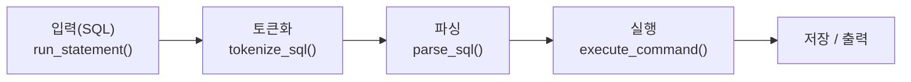
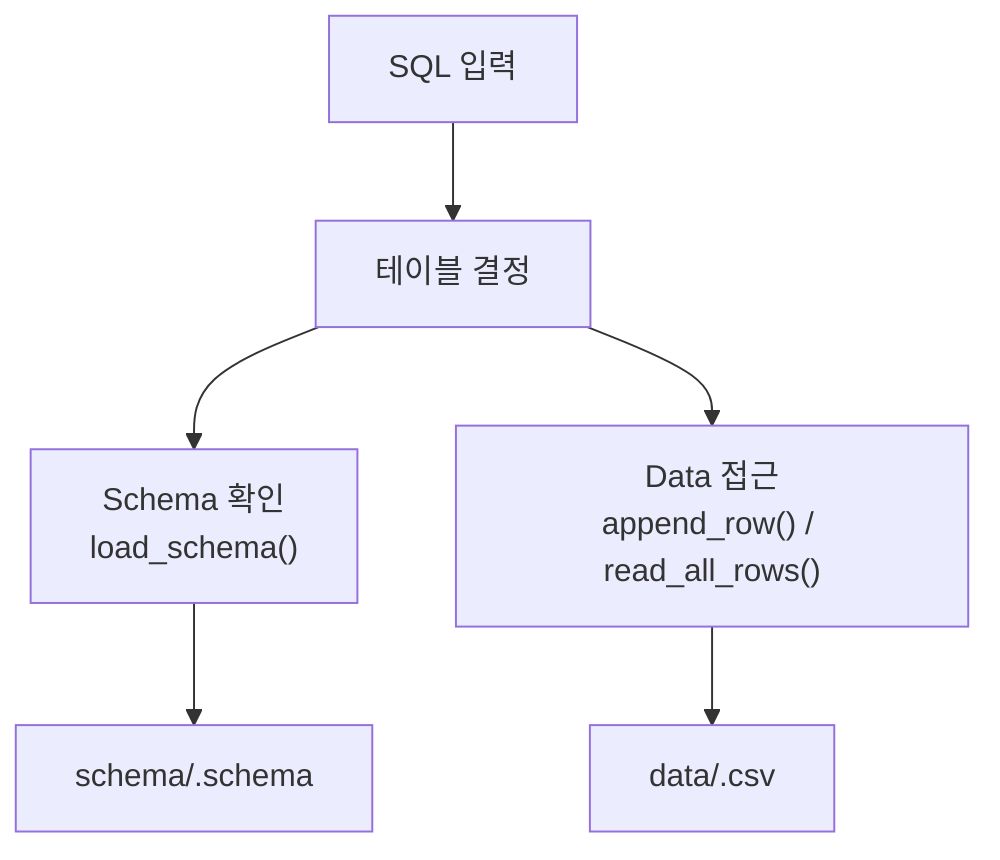
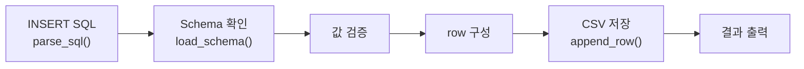
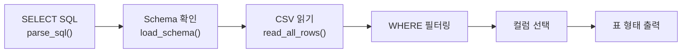
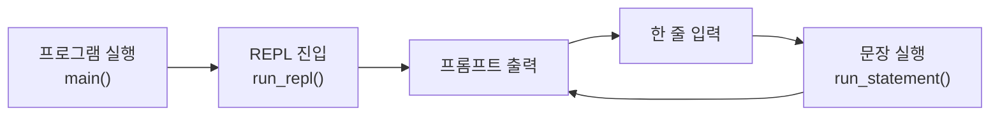

# Mini_SQL

파일 기반 실행과 REPL을 함께 지원하는 아주 작은 C SQL 처리기입니다.  
SQL 파일을 입력으로 받아 `INSERT`와 `SELECT`를 순차 실행하거나, REPL에서 한 줄씩 SQL을 입력해 실행할 수 있습니다. `schema`는 `schema/`, 데이터는 `data/` 아래 CSV 파일로 관리합니다.

현재 목표는 학습용 MVP입니다. 데이터베이스 서버를 띄우지 않고도 SQL 흐름을 끝까지 확인할 수 있도록 단순하고 읽기 쉬운 구조를 유지합니다.

## 1. 폴더 구조

- `src/`: C 구현 파일
- `include/`: 공개 헤더 파일
- `schema/`: 테이블 schema 파일
- `data/`: CSV 데이터 파일
- `sample/`: 예제 SQL 파일
- `tests/`: 단위 테스트와 fixture

## 2. 프로젝트 소개

- 구현 언어: C11
- 실행 방식:
  - 파일 실행: `./mini_sql <sql-file>`
  - REPL 실행: `./mini_sql`
- 저장 방식:
  - schema: `schema/<table>.schema`
  - data: `data/<table>.csv`

### i) 지원 SQL - INSERT 및 정책

지원 예시:

```sql
INSERT INTO users VALUES (1, 'kim', 24);
```

정책:

- 키워드는 대소문자를 구분하지 않습니다.
- 공백은 비교적 유연하게 허용합니다.
- 세미콜론은 있어도 되고 없어도 됩니다.
- 값 개수는 schema 컬럼 수와 정확히 일치해야 합니다.
- 값 순서는 schema 컬럼 순서와 같아야 합니다.
- 문자열은 작은따옴표로 감싼 형태만 지원합니다.
- `int`, `string` 타입만 지원합니다.
- 성공 시 `INSERT 1`을 출력합니다.

### ii) 지원 SQL - SELECT 및 정책

지원 예시:

```sql
SELECT * FROM users;
SELECT name, age FROM users;
SELECT * FROM users WHERE id = 1;
SELECT name, age FROM users WHERE name = 'kim';
```

정책:

- `SELECT *` 와 명시적 컬럼 선택을 지원합니다.
- `WHERE` 절은 단일 조건 1개만 지원합니다.
- `WHERE` 비교는 `=`만 지원합니다.
- 결과는 콘솔에 표 형태로 출력합니다.
- 키워드는 대소문자를 구분하지 않습니다.
- 공백은 비교적 유연하게 허용합니다.
- 세미콜론은 있어도 되고 없어도 됩니다.

## 3. 실행 방법

### 1) 빌드

```sh
cc -std=c11 -Wall -Wextra -pedantic -Iinclude src/main.c src/tokenizer.c src/parser.c src/executor.c src/schema_manager.c src/storage.c -o mini_sql
```

### 2) 실행

```sh
./mini_sql sample/basic.sql
```

또는

```sh
./mini_sql sample/insert_only.sql
./mini_sql sample/select_only.sql
./mini_sql sample/select_columns.sql
./mini_sql sample/select_where.sql
```

### 3) REPL 모드

```sh
./mini_sql
```

실행 예시:

```text
$ ./mini_sql
Mini_SQL REPL
- 한 줄에 SQL 한 문장만 입력할 수 있습니다
- 세미콜론은 있어도 되고 없어도 됩니다
- exit 또는 quit 를 입력하면 종료합니다
mini_sql> INSERT INTO users VALUES (3, 'Choi', 40)
INSERT 1
mini_sql> SELECT name, age FROM users WHERE id = 3
+------+-----+
| name | age |
+------+-----+
| Choi | 40  |
+------+-----+
(1 rows)
mini_sql> quit
```

## 4. 처리 구조

이 프로젝트는 SQL 입력을 받아 토큰화, 파싱, 실행, 저장/출력 단계로 처리합니다.  
실제 코드에서는 `run_statement()`를 중심으로 `parse_sql()`과 `execute_command()`가 연결되는 구조입니다.



- 입력(SQL): SQL 파일의 한 문장 또는 REPL 입력 한 줄을 처리 대상으로 받습니다.
- 토큰화: SQL 문자열을 token 단위로 분리합니다.
- 파싱: token 목록을 해석해 `INSERT` 또는 `SELECT` 명령 구조로 변환합니다.
- 실행: 파싱 결과를 실제 동작으로 연결합니다.
- 저장 / 출력: CSV 파일을 읽거나 쓰고, 실행 결과를 콘솔에 출력합니다.

## 5. 파일 기반 데이터 저장 방식

이 프로젝트는 별도 DB 서버 없이 schema 파일과 CSV 데이터 파일을 직접 읽고 쓰는 구조입니다.



- `schema/<table>.schema`에는 컬럼 이름과 타입이 저장됩니다.
- `data/<table>.csv`에는 실제 row 데이터가 CSV 형태로 저장됩니다.
- 각 테이블은 schema 파일 1개와 data 파일 1개로 관리됩니다.

예시:

`schema/users.schema`

```text
id:int
name:string
age:int
```

`data/users.csv`

```text
1,Alice,28
2,Bob,31
```

## 6. DB 처리 흐름

### INSERT 처리 흐름

`INSERT`는 값을 해석한 뒤 schema를 기준으로 검증하고, 최종적으로 CSV 파일에 row를 추가하는 방식으로 동작합니다.



- `INSERT` 문을 해석합니다.
- schema를 읽어 컬럼 구조를 확인합니다.
- 값 개수와 타입이 맞는지 검증합니다.
- 저장할 row를 구성한 뒤 CSV 파일 끝에 추가합니다.
- 성공 시 `INSERT 1`을 출력합니다.

### SELECT 처리 흐름

`SELECT`는 schema를 기준으로 데이터를 읽고, 필요한 경우 조건 필터링과 컬럼 선택을 적용한 뒤 표 형태로 출력합니다.



- `SELECT` 문을 해석합니다.
- schema를 읽어 컬럼 구조를 확인합니다.
- CSV 파일의 전체 row를 읽습니다.
- `WHERE` 조건이 있으면 row를 필터링합니다.
- 필요한 컬럼만 선택해 표 형태로 출력합니다.

## 7. CLI 구현 방식

CLI는 파일 실행 모드와 REPL 모드로 나뉘지만, 실제 SQL 처리 경로는 공통 실행 흐름을 재사용합니다.

### 파일 실행 모드


- SQL 파일 전체를 읽습니다.
- 세미콜론 기준으로 SQL 문장을 분리합니다.
- 각 문장을 순서대로 실행합니다.
- 실행 결과를 콘솔에 출력합니다.

### REPL 모드



- 인자 없이 실행하면 REPL 모드로 진입합니다.
- 프롬프트를 출력하고 한 줄씩 입력받습니다.
- 입력한 SQL 한 문장을 즉시 실행합니다.
- 결과를 출력한 뒤 다음 입력을 계속 받습니다.

핵심은 파일 실행 모드와 REPL 모드가 입력 방식만 다르고, 실제 SQL 실행은 공통 함수 `run_statement()`를 통해 처리된다는 점입니다.

## 8. 기능 테스트

주요 기능은 `tests/` 아래 테스트 코드로 검증합니다.

- `test_tokenizer`: SQL token 분리, 작은따옴표 처리, 연산자 처리
- `test_parser`: `INSERT`, `SELECT *`, 명시적 컬럼 `SELECT`, 단일 `WHERE` 파싱
- `test_schema_manager`: schema 로드, 값 검증, 타입 캐스팅
- `test_storage`: CSV row 저장/읽기
- `test_executor`: INSERT/SELECT 실행 흐름, projection, WHERE 필터링
- `test_main`: SQL 파일 실행, 문장 분리, REPL, end-to-end CLI 동작

대표 실행 예시:

```sh
./mini_sql
./mini_sql missing.sql
./mini_sql sample/basic.sql
./mini_sql sample/insert_only.sql
./mini_sql sample/select_only.sql
./mini_sql sample/select_where.sql
```

## 9. 미구현 부분 / 제한 사항

현재 구현은 과제의 최소 요구사항 중심의 MVP이며, 아래 항목은 지원하지 않습니다.

- `CREATE TABLE`
- `UPDATE`
- `DELETE`
- `JOIN`
- 다중 `WHERE` 조건
- `AND`, `OR`
- `>`, `<`, `>=`, `<=`, `!=`, `LIKE`
- 다중 테이블 처리
- 서브쿼리
- 집계 함수
- 정렬(`ORDER BY`)
- 그룹화(`GROUP BY`)
- 멀티라인 REPL SQL
- REPL 한 줄 내 여러 SQL 문장 분리
- `int`, `string` 외 타입

문자열/저장 관련 제한:

- 문자열은 작은따옴표로 감싼 형태만 지원합니다.
- 문자열 내부 escape 처리는 지원하지 않습니다.
- CSV 저장 시 문자열 안에 쉼표, 개행, 큰따옴표를 포함할 수 없습니다.

환경 가정:

- `schema/` 와 `data/` 디렉터리는 미리 존재해야 합니다.
- 사용할 테이블의 schema 파일은 이미 존재한다고 가정합니다.
- 즉, 현재 프로젝트는 `schema` 와 `table` 이 이미 준비된 상태에서 `INSERT`, `SELECT` 를 수행하는 SQL 처리기입니다.
