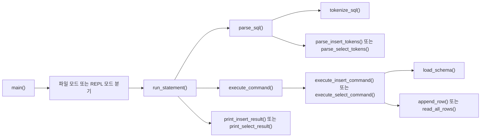
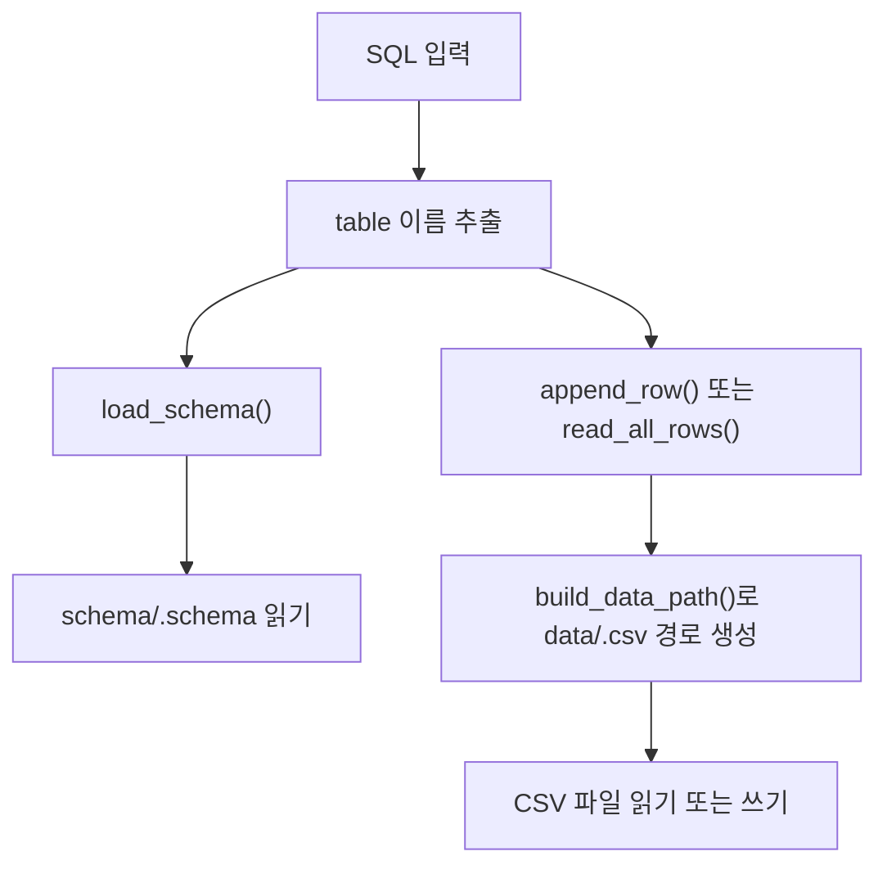
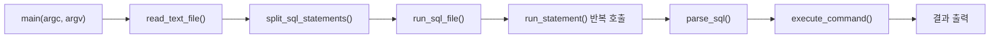
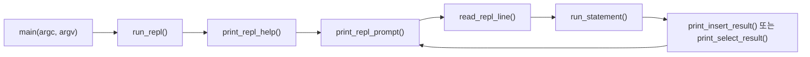
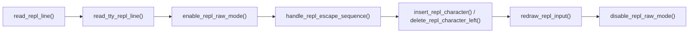

# Mini_SQL

파일 기반 실행과 REPL을 함께 지원하는 아주 작은 C SQL 처리기입니다.  
SQL 파일을 입력으로 받아 `INSERT`와 `SELECT`를 순차 실행하거나, REPL에서 한 줄씩 SQL을 입력해 실행할 수 있습니다. `schema`는 `schema/`, 데이터는 `data/` 아래 CSV 파일로 관리합니다.

현재 목표는 학습용 MVP입니다. 데이터베이스 서버를 띄우지 않고도 SQL 흐름을 끝까지 확인할 수 있도록 단순하고 읽기 쉬운 구조를 유지합니다.

## 1. 폴더 구조

- `src/`: C 구현 파일
- `include/`: 공개 헤더 파일
- `schema/`: 테이블 schema 파일
- `data/`: CSV 데이터 파일
- `sample/`: 예제 SQL 파일
- `tests/`: 단위 테스트와 fixture

## 2. 프로젝트 소개

- 구현 언어: C11
- 실행 방식:
  - 파일 실행: `./mini_sql <sql-file>`
  - REPL 실행: `./mini_sql`
- 저장 방식:
  - schema: `schema/<table>.schema`
  - data: `data/<table>.csv`

### i) 지원 SQL - INSERT 및 정책

지원 예시:

```sql
INSERT INTO users VALUES (1, 'kim', 24);
```

정책:

- 키워드는 대소문자를 구분하지 않습니다.
- 공백은 비교적 유연하게 허용합니다.
- 세미콜론은 있어도 되고 없어도 됩니다.
- 값 개수는 schema 컬럼 수와 정확히 일치해야 합니다.
- 값 순서는 schema 컬럼 순서와 같아야 합니다.
- 문자열은 작은따옴표로 감싼 형태만 지원합니다.
- `int`, `string` 타입만 지원합니다.
- 성공 시 `INSERT 1`을 출력합니다.

### ii) 지원 SQL - SELECT 및 정책

지원 예시:

```sql
SELECT * FROM users;
SELECT name, age FROM users;
SELECT * FROM users WHERE id = 1;
SELECT name, age FROM users WHERE name = 'kim';
```

정책:

- `SELECT *` 와 명시적 컬럼 선택을 지원합니다.
- `WHERE` 절은 단일 조건 1개만 지원합니다.
- `WHERE` 비교는 `=`만 지원합니다.
- 결과는 콘솔에 표 형태로 출력합니다.
- 키워드는 대소문자를 구분하지 않습니다.
- 공백은 비교적 유연하게 허용합니다.
- 세미콜론은 있어도 되고 없어도 됩니다.

## 3. 실행 방법

### 1) 빌드

```sh
cc -std=c11 -Wall -Wextra -pedantic -Iinclude src/main.c src/tokenizer.c src/parser.c src/executor.c src/schema_manager.c src/storage.c -o mini_sql
```

### 2) 실행

```sh
./mini_sql sample/basic.sql
```

또는

```sh
./mini_sql sample/insert_only.sql
./mini_sql sample/select_only.sql
./mini_sql sample/select_columns.sql
./mini_sql sample/select_where.sql
```

### 3) REPL 모드

```sh
./mini_sql
```

실행 예시:

```text
$ ./mini_sql
Mini_SQL REPL
- 한 줄에 SQL 한 문장만 입력할 수 있습니다
- 세미콜론은 있어도 되고 없어도 됩니다
- exit 또는 quit 를 입력하면 종료합니다
mini_sql> INSERT INTO users VALUES (3, 'Choi', 40)
INSERT 1
mini_sql> SELECT name, age FROM users WHERE id = 3
+------+-----+
| name | age |
+------+-----+
| Choi | 40  |
+------+-----+
(1 rows)
mini_sql> quit
```

## 4. 처리 구조

이 프로젝트의 실제 실행 흐름은 `main.c`, `parser.c`, `executor.c`, `schema_manager.c`, `storage.c`의 함수 호출 구조를 따라갑니다.



단계별 설명:

- `main()`: 프로그램 진입점이며, 인자 개수에 따라 파일 실행 모드와 REPL 모드를 나눕니다.
- `run_statement()`: 파일 모드와 REPL 모드가 공통으로 사용하는 단일 SQL 실행 함수입니다.
- `parse_sql()`: SQL 문자열을 받아 어떤 명령인지 판별하고 `Command` 구조체로 변환합니다.
- `tokenize_sql()`: SQL 문자열을 token 단위로 분리합니다.
- `parse_insert_tokens()`, `parse_select_tokens()`: token 목록을 실제 `INSERT`, `SELECT` 구조로 해석합니다.
- `execute_command()`: 파싱 결과를 받아 실제 동작을 수행합니다.
- `execute_insert_command()`, `execute_select_command()`: 명령 종류별 세부 실행 로직입니다.
- `load_schema()`: `schema/<table>.schema`를 읽어 컬럼 구조를 로드합니다.
- `append_row()`, `read_all_rows()`: CSV 데이터 파일에 row를 추가하거나 전체 row를 읽습니다.
- `print_insert_result()`, `print_select_result()`: 실행 결과를 콘솔에 출력합니다.

## 5. 파일 기반 데이터 저장 방식

이 프로젝트는 DB 서버를 사용하지 않고, schema 파일과 CSV 파일을 직접 읽고 쓰는 구조입니다.



실제 코드 기준 설명:

- schema 파일 경로는 `load_schema()`에서 `schema/<table>.schema` 형태로 만듭니다.
- `load_schema()`는 내부에서 `trim_in_place()`, `count_char()`, `parse_column_type()` 등을 사용해 schema 줄을 해석합니다.
- 데이터 파일 경로는 `build_data_path()`에서 `data/<table>.csv` 형태로 만듭니다.
- `append_row()`는 내부에서 row를 CSV 한 줄로 직렬화한 뒤 파일 끝에 append 합니다.
- `read_all_rows()`는 CSV 파일을 한 줄씩 읽어 `StorageRowList`로 복원합니다.
- `ensure_data_directory_exists()`로 `data/` 디렉터리 존재 여부를 먼저 확인합니다.

예시:

`schema/users.schema`

```text
id:int
name:string
age:int
```

`data/users.csv`

```text
1,Alice,28
2,Bob,31
```

## 6. DB 처리 흐름

### INSERT 처리 흐름

`INSERT`는 실제로 아래 함수 흐름으로 실행됩니다.

```mermaid
flowchart LR
    A["run_statement()"] --> B["parse_sql()"]
    B --> C["tokenize_sql()"]
    C --> D["parse_insert_tokens()"]
    D --> E["execute_command()"]
    E --> F["execute_insert_command()"]
    F --> G["load_schema()"]
    G --> H["validate_values()"]
    H --> I["build_storage_row_from_insert()"]
    I --> J["cast_value()"]
    J --> K["append_row()"]
    K --> L["print_insert_result()"]
```



실제 의미:

- `parse_sql()`이 `INSERT` 문인지 판별합니다.
- `parse_insert_tokens()`가 `table_name`, `values`를 추출합니다.
- `execute_insert_command()`가 schema를 로드합니다.
- `validate_values()`로 값 개수와 타입이 schema와 맞는지 검증합니다.
- `build_storage_row_from_insert()`에서 저장용 row를 만듭니다.
- `cast_value()`로 raw token을 실제 타입으로 변환합니다.
- `append_row()`가 `data/<table>.csv`에 row를 추가합니다.
- 마지막에 `print_insert_result()`가 `INSERT 1`을 출력합니다.

### SELECT 처리 흐름

`SELECT`는 실제로 아래 함수 흐름으로 실행됩니다.

```mermaid
flowchart LR
    A["run_statement()"] --> B["parse_sql()"]
    B --> C["tokenize_sql()"]
    C --> D["parse_select_tokens()"]
    D --> E["parse_select_columns()"]
    E --> F["parse_select_where_clause()"]
    F --> G["execute_command()"]
    G --> H["execute_select_command()"]
    H --> I["load_schema()"]
    I --> J["read_all_rows()"]
    J --> K["apply_select_where_filter()"]
    K --> L["print_select_result()"]
```



실제 의미:

- `parse_sql()`이 `SELECT` 문인지 판별합니다.
- `parse_select_tokens()`가 전체 SELECT 구조를 해석합니다.
- `parse_select_columns()`가 `*` 또는 명시적 컬럼 목록을 해석합니다.
- `parse_select_where_clause()`가 `WHERE <column> = <value>` 형태를 해석합니다.
- `execute_select_command()`가 schema를 로드하고 CSV 전체 row를 읽습니다.
- `read_all_rows()`가 `data/<table>.csv`를 `StorageRowList`로 읽어옵니다.
- `apply_select_where_filter()`가 단일 `WHERE` 조건을 적용합니다.
- 마지막에 `print_select_result()`가 표 형태로 결과를 출력합니다.

## 7. CLI 구현 방식

### 파일 실행 모드

파일 실행 모드는 `main()`에서 인자가 1개 들어왔을 때 동작합니다.



실제 코드 기준 설명:

- `read_text_file()`이 SQL 파일 전체를 문자열로 읽습니다.
- `split_sql_statements()`가 세미콜론 기준으로 SQL 문장을 분리합니다.
- `run_sql_file()`이 분리된 문장을 순서대로 실행합니다.
- 각 문장은 공통 함수인 `run_statement()`를 통해 처리됩니다.
- 즉, 파일 모드도 결국 `parse_sql() -> execute_command() -> 출력` 흐름을 재사용합니다.

### REPL 모드

REPL 모드는 `main()`에서 인자가 없을 때 `run_repl()`로 진입합니다.



TTY 환경에서의 입력 처리 흐름은 아래와 같습니다.



실제 코드 기준 설명:

- `print_repl_help()`가 REPL 안내 문구를 출력합니다.
- `print_repl_prompt()`가 `mini_sql>` 프롬프트를 출력합니다.
- `read_repl_line()`이 한 줄 입력을 읽습니다.
- TTY 환경에서는 `read_tty_repl_line()`이 raw mode로 입력을 직접 처리합니다.
- `enable_repl_raw_mode()`와 `disable_repl_raw_mode()`가 터미널 설정을 제어합니다.
- `handle_repl_escape_sequence()`가 좌우 화살표 입력을 처리합니다.
- `insert_repl_character()`, `delete_repl_character_left()`, `redraw_repl_input()`로 한 줄 편집을 지원합니다.
- 입력된 한 줄은 다시 `run_statement()`로 전달되어 파일 모드와 동일한 실행 흐름을 탑니다.

## 8. 기능 테스트

주요 기능은 `tests/` 아래 테스트 코드로 검증합니다.

- `test_tokenizer`: SQL token 분리, 작은따옴표 처리, 연산자 처리
- `test_parser`: `INSERT`, `SELECT *`, 명시적 컬럼 `SELECT`, 단일 `WHERE` 파싱
- `test_schema_manager`: schema 로드, 값 검증, 타입 캐스팅
- `test_storage`: CSV row 저장/읽기
- `test_executor`: INSERT/SELECT 실행 흐름, projection, WHERE 필터링
- `test_main`: SQL 파일 실행, 문장 분리, REPL, end-to-end CLI 동작

대표 실행 예시:

```sh
./mini_sql
./mini_sql missing.sql
./mini_sql sample/basic.sql
./mini_sql sample/insert_only.sql
./mini_sql sample/select_only.sql
./mini_sql sample/select_where.sql
```

## 9. 미구현 부분 / 제한 사항

현재 구현은 과제의 최소 요구사항 중심의 MVP이며, 아래 항목은 지원하지 않습니다.

- `CREATE TABLE`
- `UPDATE`
- `DELETE`
- `JOIN`
- 다중 `WHERE` 조건
- `AND`, `OR`
- `>`, `<`, `>=`, `<=`, `!=`, `LIKE`
- 다중 테이블 처리
- 서브쿼리
- 집계 함수
- 정렬(`ORDER BY`)
- 그룹화(`GROUP BY`)
- 멀티라인 REPL SQL
- REPL 한 줄 내 여러 SQL 문장 분리
- `int`, `string` 외 타입

문자열/저장 관련 제한:

- 문자열은 작은따옴표로 감싼 형태만 지원합니다.
- 문자열 내부 escape 처리는 지원하지 않습니다.
- CSV 저장 시 문자열 안에 쉼표, 개행, 큰따옴표를 포함할 수 없습니다.

환경 가정:

- `schema/` 와 `data/` 디렉터리는 미리 존재해야 합니다.
- 사용할 테이블의 schema 파일은 이미 존재한다고 가정합니다.
- 즉, 현재 프로젝트는 `schema` 와 `table` 이 이미 준비된 상태에서 `INSERT`, `SELECT` 를 수행하는 SQL 처리기입니다.
